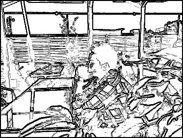

# Sketch Filter
This is a small programme that applies the 'sketch' filter to a given image. 

Usage:

_sketch_filter(input_filename, save=false, keep_top=.25, num_cols=1)_

_save_: This controls whether the output image will be saved or not. If true, a prompt will ask the user for the output filename.
_keep_top_: This controls what percentage of the brightest pixels to highlight in the sketch. By default, only the top 25% brightest pixels are sketched.  
_num_cols_: This controls how many shades of gray the output will have.
The default value is 1, meaning that the output will only contain pure black (_grayscale(0)_) sketchlines (on top of a white background). Increasing num_cols will divide up the interval between grayscale(0) and grayscale(255) into equal parts, and use that to draw the corresponding brightest quantile.

So for example, if you have _keep_top=.3, num_cols=2_, then the output will be drawn with two shades of gray for the brightest 30% pixels, plus white background for the remaining 70%. The brightest 30% will be further divided into two halves based on brightness, and the brighter half will receive the darker shade.

Example:

Input image:

Output image:

